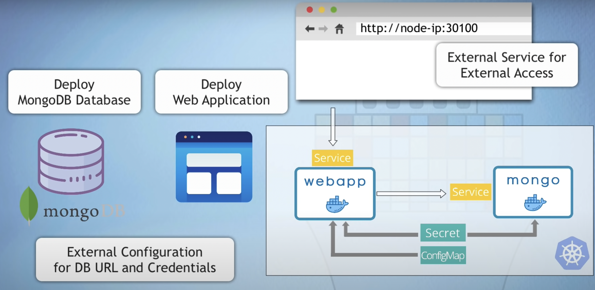

# K8s Deployment Project

This project demonstrates the deployment of a web application with a MongoDB database on a Kubernetes (K8s) cluster using Minikube. The application is based on the official MongoDB and a simple web app available on Docker Hub.

## Prerequisites

Before you start, ensure you have the following tools installed:

- [Minikube](https://minikube.sigs.k8s.io/docs/start/)
- [kubectl](https://kubernetes.io/docs/tasks/tools/)
- [Docker](https://docs.docker.com/get-docker/)
  
## K8s manifest files 
* mongo-config.yaml
* mongo-secret.yaml
* mongo.yaml
* webapp.yaml

## K8s commands

##### start Minikube and check status
    minikube start --driver docker 
    minikube status

##### get minikube node's ip address
    minikube ip

##### get basic info about k8s components
    kubectl get node
    kubectl get pod
    kubectl get svc
    kubectl get all

##### get extended info about components
    kubectl get pod -o wide
    kubectl get node -o wide

##### get detailed info about a specific component
    kubectl describe svc {svc-name}
    kubectl describe pod {pod-name}

##### get application logs
    kubectl logs {pod-name}
    
##### stop your Minikube cluster
    minikube stop

 

> :warning: **Known issue - Minikube IP not accessible** 

If you can't access the NodePort service webapp with `MinikubeIP:NodePort`, execute the following command:
    
    minikube service webapp-service

 

## Links
* mongodb image on Docker Hub: https://hub.docker.com/_/mongo
* webapp image on Docker Hub: https://hub.docker.com/repository/docker/nanajanashia/k8s-demo-app
* k8s official documentation: https://kubernetes.io/docs/home/
* webapp code repo: https://gitlab.com/nanuchi/developing-with-docker/-/tree/feature/k8s-in-hour

## What Have I Learned?
This project taught me how to deploy a web application and a database on a Kubernetes cluster using Minikube and kubectl tools. I learned how to create and manage Kubernetes manifest files, work with ConfigMaps and Secrets, and troubleshoot common issues. I also gained practical experience with Kubernetes commands for managing and inspecting the cluster.

## Special Thanks
A special thanks to [Nana](https://gitlab.com/nanuchi) for her excellent [YouTube channel](https://www.youtube.com/@TechWorldwithNana) and the amazing [tutorial](https://www.youtube.com/watch?v=s_o8dwzRlu4&t=104s&pp=ygUTa3ViZXJuZXRlcyB0dXRvcmlhbA%3D%3D) on deploying applications in Kubernetes. Your content has been incredibly helpful and inspiring!
