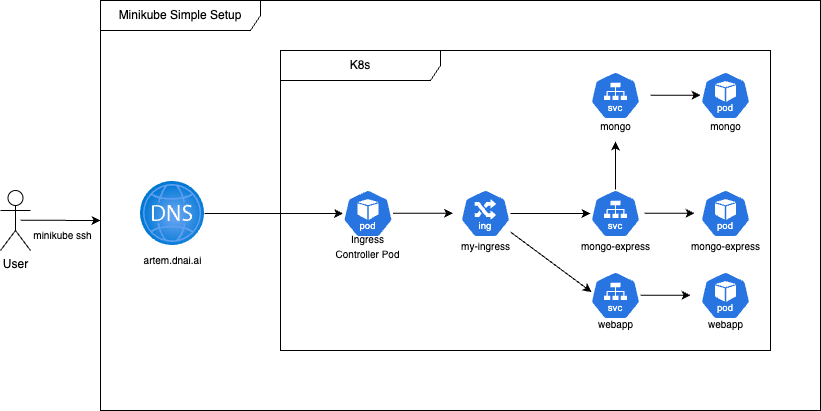
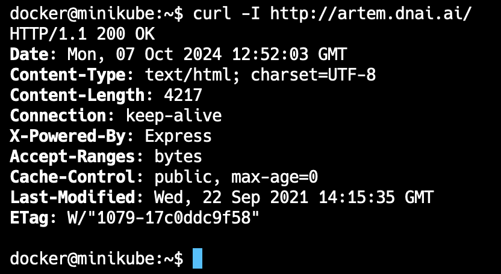
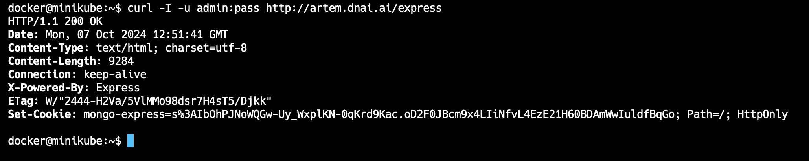

# K8s Deployment Project

This project demonstrates the deployment of a web application with a MongoDB database on a Kubernetes (K8s) cluster using Minikube and AKS. The application is based on the official MongoDB and a simple web app available on Docker Hub.

## Prerequisites

Before you start, ensure you have the following tools installed:

- [Minikube](https://minikube.sigs.k8s.io/docs/start/)
- [kubectl](https://kubernetes.io/docs/tasks/tools/)
- [Docker](https://docs.docker.com/get-docker/)
- Account on Azure Cloud
  
## K8s manifest files 
* mongo-config.yaml
* mongo-secret.yaml
* mongo-exprerss.yaml
* mongo.yaml
* webapp.yaml

## K8s commands

### Minikube

##### start Minikube and check status
    minikube start driver docker 
    minikube status

##### apply all k8s manifests in manifests/ folder
    kubectl apply -f mongo-secret.yml
    kubectl apply -f mongo-config.yml
    kubectl apply -f mongo-mongo.yml
    kubectl apply -f mongo-express.yml
    kubectl apply -f webapp.yml
    kubectl apply -f ingress.yml

##### get ip address of the minikube
    minikube ip
    (or) kubectl get ingress

##### add this record to the end of the /etc/hosts file
    192.168.49.2 artem.dnai.ai

#### Testing

##### go inside minikube container
    minikube ssh

##### execute http request for / path
    curl -I http://artem.dnai.ai

#### execute http req for /express path
    curl -I -u admin:pass http://artem.dnai.ai/express

    

 

> :warning: **Known issue - Request is timeout** 

If you can't access the endpoints, try executing the following command in the side terminal window:
    
    minikube tunnel

 

